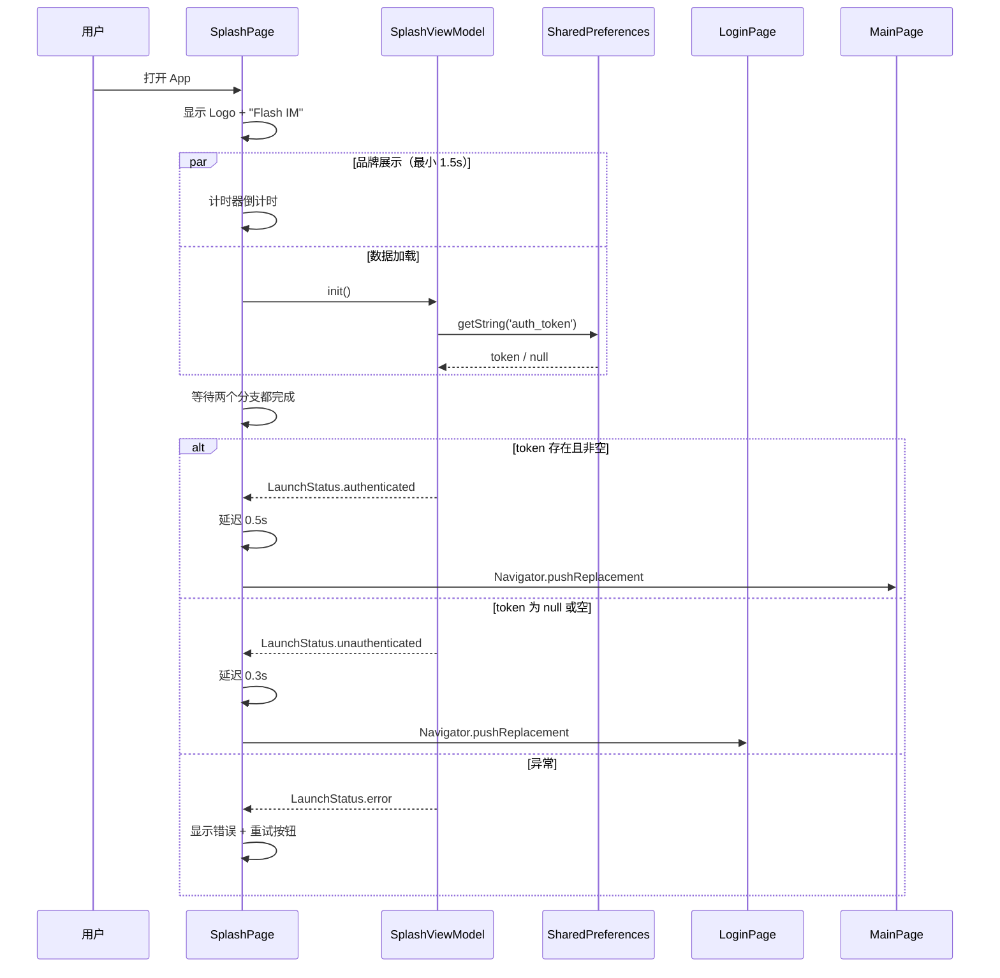
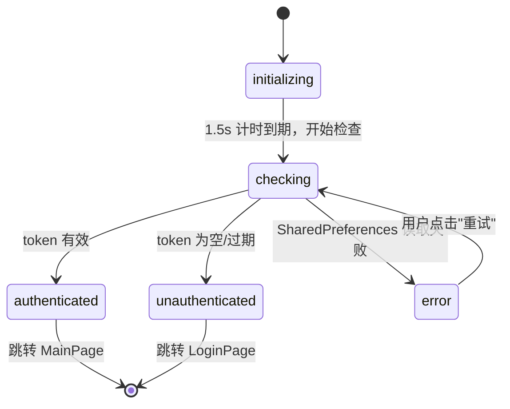

# 应用启动 — 客户端设计报告

## 1. 目标

- 创建应用启动页：**居中 Logo + "Flash IM" 文字**，持续至少 1.5 秒
- 启动期间异步加载本地配置与缓存（Token、用户偏好等）
- 根据认证状态分流跳转：
  - 已登录（有有效 Token）→ 主页面（占位）
  - 未登录 / Token 过期 → 登录页面（复用 playground AuthLoginPage 占位）
- 将 `main.dart` 重写为正式入口，与 playground 解耦

## 2. 现状分析

### 2.1 已有能力

| 能力 | 位置 | 说明 |
|------|------|------|
| Token 持久化 | `AuthService._tokenKey` / `SharedPreferences` | 读写 `auth_token` |
| 登录状态判断 | `AuthService.isLoggedIn()` | 检查 SharedPreferences 中是否有 token |
| 登录页面 | `playground/auth/views/auth_login_page.dart` | 短信 + 密码登录，UI 完整 |
| 主页面 | `playground/chat_room/views/chat_room_page.dart` | 底部导航 + 聊天室 + 我的 |

### 2.2 存在的问题

| 问题 | 说明 |
|------|------|
| 无启动流程 | 应用直入 playground，无品牌展示、无初始化 |
| `main.dart` 是默认计数器 | 真正入口是 `main_playground.dart`，混乱 |
| 无统一初始化阶段 | Token 读取分散在各 ViewModel，无集中加载 |
| 无白屏保底 | 启动期间可能出现短暂白屏 |

### 2.3 基础设施就绪

| 基础设施 | 状态 | 说明 |
|----------|------|------|
| `shared_preferences` | ✅ 已在 pubspec.yaml | 读写本地 KV 存储 |
| `dio` | ✅ 已在 pubspec.yaml | HTTP 请求 |
| assets 目录 | ❌ 不存在 | 需新建，配置 logo 图片 |
| Playground 页面 | ✅ 完整 | 可复用占位跳转 |

## 3. 数据模型与接口

### 3.1 启动状态

```dart
enum LaunchStatus { initializing, checking, authenticated, unauthenticated, error }
```

| 状态 | 含义 | UI 表现 |
|------|------|---------|
| `initializing` | 刚启动，基础初始化 | Logo 展示，无额外文字 |
| `checking` | 读取 Token / 配置中 | Logo + "正在加载…" |
| `authenticated` | Token 有效 | Logo + 淡入成功，2 秒后跳转主页 |
| `unauthenticated` | 无 Token 或过期 | Logo + 淡入，1 秒后跳转登录 |
| `error` | 初始化异常 | Logo + "加载失败，请重试" + 重试按钮 |

### 3.2 启动配置

```dart
class SplashConfig {
  static const Duration minDisplayTime = Duration(milliseconds: 1500);
  static const Duration authCheckTimeout = Duration(seconds: 5);
  static const String logoPath = 'assets/images/logo.png';
  static const String appName = 'Flash IM';
}
```

### 3.3 接口速览

**启动阶段不发起网络请求**。仅读取本地 SharedPreferences：

```
启动流程：
  main() → SplashPage
    ├── 1.5s 品牌展示（最小展示时间）
    ├── 异步：从 SharedPreferences 读取 auth_token
    ├── 异步：从 SharedPreferences 读取其他配置（user_id、主题等）
    └── 完成 → 跳转 LoginPage / MainPage
```

| 操作 | 来源 | 说明 |
|------|------|------|
| `SharedPreferences.getString('auth_token')` | 本地 | 判断是否已登录 |
| `SharedPreferences.getInt('auth_user_id')` | 本地 | 用户 ID |
| `SharedPreferences.getString('auth_nickname')` | 本地 | 昵称缓存 |

## 4. 核心流程

### 4.1 启动 → 分流



### 4.2 状态转换



### 4.3 关键业务规则

1. **最小展示时间**：启动页至少显示 1.5 秒，即使数据加载已完成也等到计时结束
2. **超时保护**：SharedPreferences 读取超时 5 秒，超时后视为 error
3. **Token 校验**：只检查是否存在 + 非空，不在启动阶段请求 `/user/profile` 验证（减少启动延迟）
4. **跳转用 pushReplacement**：启动页不可回退

## 5. 项目结构与技术决策

### 5.1 项目结构

```
flash_im/
├── assets/
│   └── images/
│       └── logo.png                     # [新增] 品牌 Logo
├── lib/
│   ├── main.dart                        # [重写] 新入口
│   ├── main_playground.dart             # [保留] 游乐场入口（不改）
│   └── src/
│       ├── splash/                      # [新增] 启动模块
│       │   ├── config/
│       │   │   └── splash_config.dart   # 启动配置常量
│       │   ├── models/
│       │   │   └── launch_state.dart    # 启动状态枚举 + 数据类
│       │   ├── viewmodel/
│       │   │   └── splash_viewmodel.dart # 启动逻辑（初始化编排）
│       │   └── views/
│       │       └── splash_page.dart     # 启动页 UI
│       ├── app/
│       │   └── app.dart                 # [新增] MaterialApp 根组件
│       ├── views/
│       │   ├── login_page.dart          # [新增] 登录页占位（直达 playground 登录）
│       │   └── main_page.dart           # [新增] 主页占位（直达 playground 主页）
│       └── playground/                  # [保留] 游乐场（不改）
└── pubspec.yaml                         # 新增 assets 配置
```

### 5.2 职责划分

```
main() ── 调用 runApp(FlashImApp())
  └── FlashImApp (MaterialApp)
      └── SplashPage (initialRoute)
          ├── SplashViewModel
          │   ├── 读 SharedPreferences（auth_token）
          │   └── 产出 LaunchStatus
          └── 根据状态:
              ├── authenticated → MainPage
              └── unauthenticated   → LoginPage

依赖方向（单向）：
  SplashPage → SplashViewModel → SharedPreferences
  SplashPage → LoginPage / MainPage（导航，不依赖其内部）
```

### 5.3 技术决策

| 决策 | 方案 | 理由 |
|------|------|------|
| 状态管理 | 纯 `ChangeNotifier` + 自身 ViewModel | 启动页逻辑简单，不引入额外库 |
| Token 校验 | 仅判空，不发网络请求 | 减少启动延迟，后续页面自行校验 |
| 页面切换 | `Navigator.pushReplacement` | 启动页不可返回 |
| Logo 展示 | `Image.asset` | 本地资源，零网络延迟 |
| 最小时间控制 | `Future.delayed` + `Future.wait` | 品牌展示时间可控 |
| 与 playground 关系 | 引用 playground 页面，不修改 | 游乐场仍可独立运行 |

### 5.4 新增/变更文件

| 文件 | 类型 | 说明 |
|------|------|------|
| `assets/images/logo.png` | 新增 | 品牌 Logo（用户提供） |
| `lib/main.dart` | 重写 | 应用入口 |
| `lib/src/app/app.dart` | 新增 | MaterialApp 根组件 |
| `lib/src/splash/` | 新增 | 启动模块全部文件 |
| `lib/src/views/login_page.dart` | 新增 | 登录入口占位 |
| `lib/src/views/main_page.dart` | 新增 | 主页入口占位 |
| `pubspec.yaml` | 修改 | 添加 assets 配置 |
| `lib/main_playground.dart` | 不变 | 保留游乐场入口 |

## 6. 暂不实现

| 功能 | 理由 |
|------|------|
| 启动期网络 Token 校验（`GET /user/profile`） | 增加启动延迟，后续页面自行校验 |
| 启动广告 / 运营图 | 非核心功能 |
| 引导页（Onboarding） | 需要设计稿和文案，后续版本 |
| 版本更新检测 | 依赖后端版本接口，后续版本 |
| 启动日志上报 | 需要埋点基础设施 |
| 深色模式适配 | Logo 需要深浅两套资源，后续版本 |
