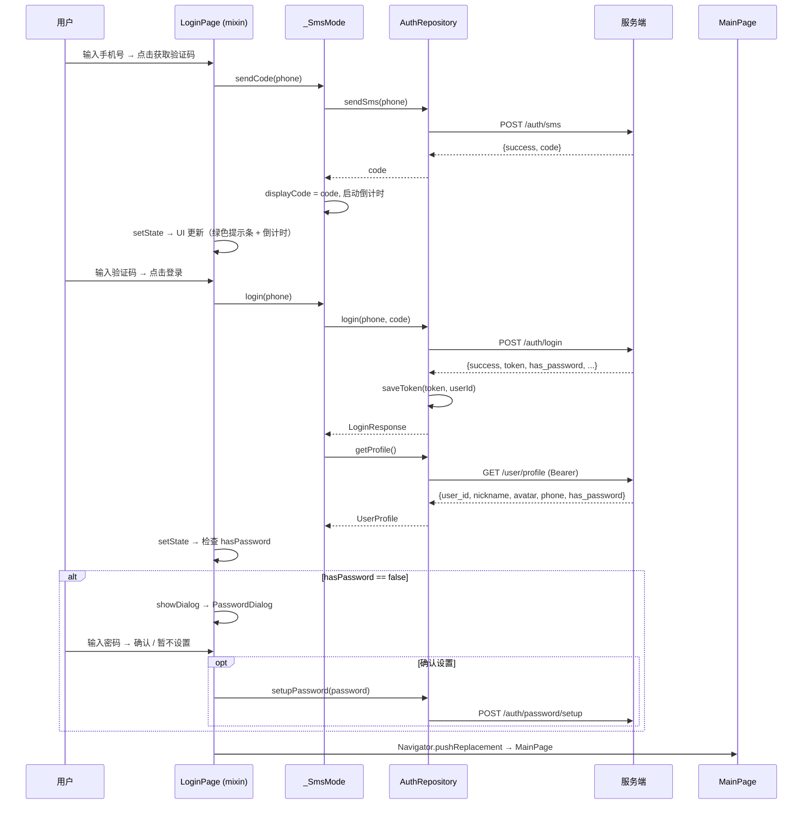
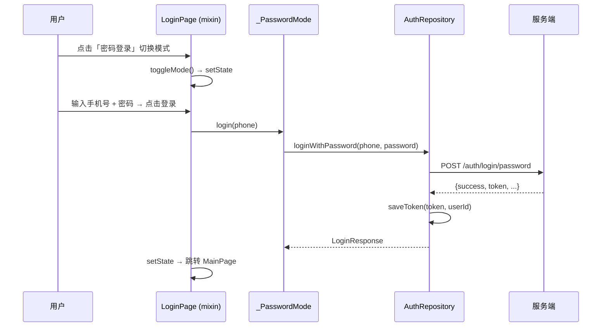
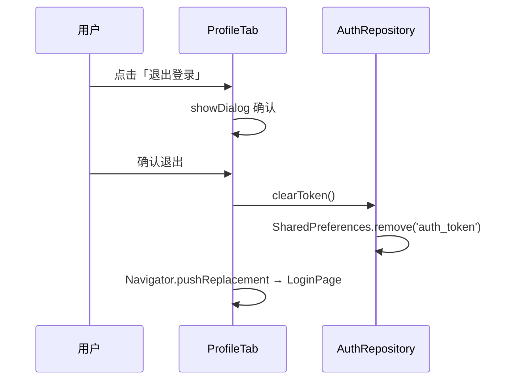
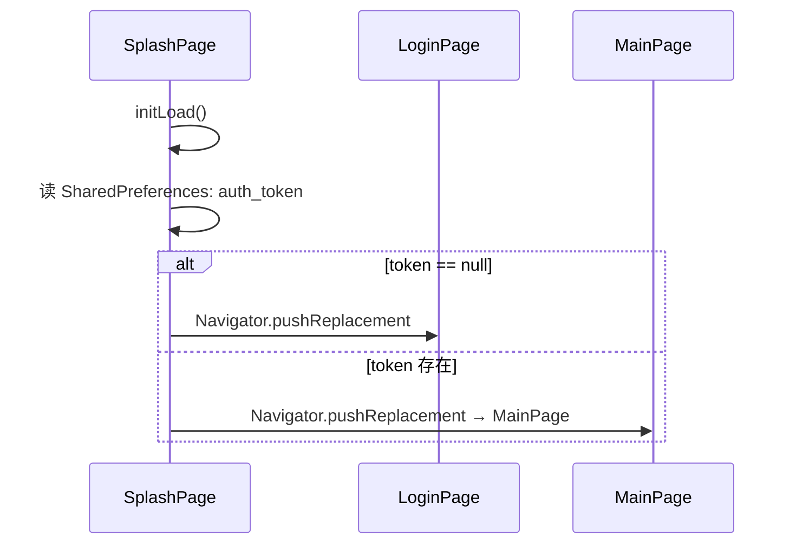

# 登录认证 + 主框架 — 客户端设计报告

## 1. 目标

- 实现正式 App 的**简约风格登录页**：手机号 + 验证码登录，支持切换为密码登录
- 登录后检测 `hasPassword`，未设置密码时**弹出设置提示框**引导设置
- Token 持久化到 `SharedPreferences`，下次启动**保持登录态**（与 Splash 模块衔接）
- 登录成功后进入**底部三 Tab 主框架**：消息（留白）、通讯录（留白）、我的（个人信息 + 退出登录）
- 「我的」页面参考 Playground 已实现风格，展示用户信息并支持**简易退出登录**
- 使用 **mixin + 模式子类** 分离 UI 与业务逻辑，不引入额外状态管理框架

## 2. 现状分析

### 2.1 已有能力

| 能力 | 实现位置 | 说明 |
|------|----------|------|
| 后端认证接口 | `im-server` | `/auth/sms`、`/auth/login`、`/auth/login/password`、`/auth/password/setup`、`/user/profile` |
| Token 持久化 | `AuthService`（Playground） | SharedPreferences 读写 `auth_token` / `auth_user_id` |
| 登录 UI 原型 | `AuthLoginPage`（Playground） | 手机号 + 验证码 + 密码登录形态完整 |
| 个人中心 UI 原型 | `AuthProfilePage`（Playground） | 头像、昵称、手机号、退出登录 |
| 网络层 | Dio + `AuthConfig` | 已有基础请求封装 |
| 启动路由 | Splash 模块（tasks.md 已设计） | 根据 Token 决定跳转 LoginPage 或 HomePage |

### 2.2 存在的问题

- Playground 的 Auth 模块使用 `ChangeNotifier`，登录页的 UI 状态（手机号、验证码、模式切换）不需要跨页面共享，重新思考方案
- Playground 的登录/个人中心是独立页面，本项目需要嵌入 **Tab 框架**中
- 无 「消息」「通讯录」占位 Tab
- Splash 模块中 `LoginPage` 和 `HomePage` 为文字占位，需要替换为真实实现

### 2.3 基础设施

| 项目 | 状态 | 说明 |
|------|------|------|
| SharedPreferences | 已有 | Token 存储复用 |
| Splash 路由 | 已设计 | tasks.md 定义了 LoginPage / HomePage 占位路径 |
| 后端服务 | 已有 | 端口 3000，本机运行 |

### 2.4 路由上下文

```
Splash 模块（已设计）路由分发：
  Token 存在 → HomePage (MainPage with tabs)
  Token 不存在 → LoginPage

本模块负责：
  ✅ LoginPage 真实实现（替换占位）
  ✅ HomePage → MainPage（Tab 主框架，替换占位）
  ✅ 我的 Tab（ProfileTab）← 参考 Playground AuthProfilePage
  ✅ 消息 Tab（空白占位）
  ✅ 通讯录 Tab（空白占位）
```

## 3. 数据模型与接口

### 3.1 状态管理方案：mixin + 模式子类

**设计思路**：登录页的 UI 状态（手机号、验证码显示、倒计时、模式切换）生命周期仅限 LoginPage 存活期间，登录成功后页面被 `pushReplacement` 替换，无需跨页面共享。因此不引入 `flutter_bloc`，用一个 `mixin` 承担数据与业务逻辑，`State` 类只管 UI 构建。

每种登录方式是**自包含的内部类**，拥有自己的输入控制器、校验逻辑和数据字段：

```dart
/// 验证码登录模式 — 持有自己独有的数据
class _SmsMode {
  final codeCtrl = TextEditingController();
  String? displayCode;
  int countdown = 0;
  Timer? timer;

  bool canLogin(String phone) =>
      phone.length == 11 && codeCtrl.text.length >= 4;

  Future<String?> sendCode(String phone, AuthRepository repo) async { ... }

  Future<LoginResponse> login(String phone, AuthRepository repo) async {
    return repo.login(phone, codeCtrl.text);
  }

  void dispose() { codeCtrl.dispose(); timer?.cancel(); }
}
```

```dart
/// 密码登录模式 — 持有自己独有的数据
class _PasswordMode {
  final pwdCtrl = TextEditingController();

  bool canLogin(String phone) =>
      phone.length == 11 && pwdCtrl.text.length >= 6;

  Future<LoginResponse> login(String phone, AuthRepository repo) async {
    return repo.loginWithPassword(phone, pwdCtrl.text);
  }

  void dispose() { pwdCtrl.dispose(); }
}
```

```dart
/// 薄转发层 — 只持有共享数据，把调用委托给当前激活的模式
mixin LoginLogic on State<LoginPage> {
  final phoneCtrl = TextEditingController();
  final _repo = AuthRepository();

  var _isLoading = false;
  String? _error;
  var _isPasswordMode = false;

  final _sms = _SmsMode();
  final _pwd = _PasswordMode();

  // 只暴露 View 真正需要的属性
  bool get isLoading => _isLoading;
  String? get error => _error;
  bool get isPasswordMode => _isPasswordMode;
  String? get displayCode => _isPasswordMode ? null : _sms.displayCode;
  int get countdown => _isPasswordMode ? 0 : _sms.countdown;
  bool get canSendCode =>
      !_isPasswordMode && _sms.countdown == 0 && phoneCtrl.text.length == 11;
  TextEditingController get inputCtrl =>
      _isPasswordMode ? _pwd.pwdCtrl : _sms.codeCtrl;

  void toggleMode() => setState(() { _isPasswordMode = !_isPasswordMode; _error = null; });
  void clearError() => setState(() => _error = null);

  Future<void> sendCode() async { ... }
  Future<void> login() async { ... }

  void disposeAll() { phoneCtrl.dispose(); _sms.dispose(); _pwd.dispose(); }
}
```

> **关键点**：
> - `_SmsMode` / `_PasswordMode` 互不污染彼此的数据字段。`displayCode` 不存在于 `_PasswordMode` 中，类型系统天然保证。
> - `LoginLogic` mixin 不超 50 行，仅做共享字段持有 + 模式转发。
> - 切换模式时旧模式的控制器仍在对象上，但 View 不再引用它（`inputCtrl` 返回新模式的控制器）。
> - 新增第三种登录方式（如邮箱验证码）只需加一个 `_EmailMode` 类，不碰现有代码。

### 3.2 数据模型（复用 Playground）

| 模型 | 路径 | 说明 |
|------|------|------|
| `LoginResponse` | `app/auth/data/models/` | 从 Playground 迁移，字段对齐后端 |
| `UserProfile` | `app/auth/data/models/` | 从 Playground 迁移，字段对齐后端 |

这两个模型从 Playground 复制，去掉 ChangeNotifier 相关代码，保持纯数据类。

### 3.3 接口契约

本模块复用的后端 API：

| 方法 | 路径 | 说明 |
|------|------|------|
| POST | `/auth/sms` | 发送短信验证码 |
| POST | `/auth/login` | 验证码登录 |
| POST | `/auth/login/password` | 密码登录 |
| POST | `/auth/password/setup` | 设置初始密码 |
| GET | `/user/profile` | 获取用户信息（需 Bearer Token） |

### 3.4 密码设置弹窗流程

```
登录成功 → hasPassword == false
  → 弹出 AlertDialog
    ├── 标题：「设置密码」
    ├── 内容：密码输入框 + 确认密码输入框
    ├── 「确认」按钮 → POST /auth/password/setup → 成功关闭弹窗
    └── 「暂不设置」按钮 → 关闭弹窗，进入主页
  → hasPassword == true → 直接进入主页
```

| 决策 | 理由 |
|------|------|
| 使用 AlertDialog 而非独立页面 | 不打断 Tab 框架的初始化流程，用户感知轻量 |
| 弹窗不可点遮罩关闭 | 密码设置具有安全属性，须用户主动操作 |
| 「暂不设置」兜底 | 用户可能暂时不想设置，不应阻塞使用 |

## 4. 核心流程

### 4.1 验证码登录 → 密码检测 → 主页



### 4.2 密码登录流程



### 4.3 退出登录 → 回到登录页



### 4.4 Splash → 路由分发



> **注意**：Splash 模块的 `SplashService` 使用 key `auth_token`，本模块 `AuthRepository` 也使用同一 key，保证状态一致。

## 5. 项目结构与技术决策

### 5.1 项目结构

```
flash_im/lib/src/app/
├── splash/                                     # 启动模块（不变）
│   ├── config/splash_config.dart
│   ├── models/splash_state.dart
│   ├── services/splash_service.dart
│   ├── viewmodel/splash_viewmodel.dart
│   └── views/splash_page.dart
├── auth/                                       # [新增] 认证模块
│   ├── data/
│   │   ├── models/
│   │   │   ├── login_response.dart             # [迁移] 登录响应模型
│   │   │   ├── login_type.dart                 # [迁移] 登录类型常量
│   │   │   └── user_profile.dart               # [迁移] 用户信息模型
│   │   ├── repositories/
│   │   │   └── auth_repository.dart            # Token 持久化 + API 调用编排
│   │   └── services/
│   │       └── auth_api_service.dart           # Dio HTTP 请求封装
│   └── views/
│       ├── login_page.dart                     # [替换占位] 登录页（mixin 方案）
│       └── password_dialog.dart                # 密码设置弹窗
├── home/                                       # [修改] 主框架模块
│   └── views/
│       ├── main_page.dart                      # [替换占位] 底部三 Tab 主框架
│       ├── messages_tab.dart                   # 消息 Tab（留白）
│       ├── contacts_tab.dart                   # 通讯录 Tab（留白）
│       └── profile_tab.dart                    # 我的 Tab（FutureBuilder 加载 profile）
├── shared/                                     # [新增] 共享模块
│   └── config/
│       └── api_config.dart                     # API 基础 URL 配置
└── playground/                                 # Playground（不动）
```

### 5.2 职责划分

```
View 层:
  LoginPage ────────── StatefulWidget + LoginLogic mixin
    ├── mixin 持有 _SmsMode / _PasswordMode 两个子对象
    ├── 模式切换时 setState，View 通过 inputCtrl / displayCode / countdown 响应
    ├── _SmsMode.sendCode() → API → setState 更新 UI
    ├── _PasswordMode.login() / _SmsMode.login() → API → setState → 跳转
    └── 登录成功后检测 hasPassword → 可能弹出 PasswordDialog → 跳转 MainPage

  PasswordDialog ───── 密码设置弹窗（AlertDialog）
    ├── 直接调用 AuthRepository.setupPassword()
    └── 「暂不设置」直接关闭

  MainPage ─────────── 底部 TabBar 容器
    ├── IndexedStack 保持各 Tab 状态
    └── Tab 0: MessagesTab / Tab 1: ContactsTab / Tab 2: ProfileTab

  ProfileTab ───────── 我的页面
    ├── initState 中 FutureBuilder / 手动调用 AuthRepository.getProfile()
    ├── 头像 + 昵称 + ID（参考 Playground AuthProfilePage 风格）
    ├── 信息卡片：手机号、昵称、头像
    └── 退出登录按钮 → AuthRepository.clearToken() → Navigator.pushReplacement

Mixin (LoginLogic):
  LoginLogic ───────── 薄转发层，持有共享数据
    ├── phoneCtrl（共享的手机号输入控制器）
    ├── _sms: _SmsMode（验证码模式的数据 + 逻辑）
    ├── _pwd: _PasswordMode（密码模式的数据 + 逻辑）
    ├── toggleMode() → 切换到另一种模式 → setState
    ├── sendCode() → 委托 _sms.sendCode() → setState
    └── login() → 委托当前模式的 login() → setState

模式子类:
  _SmsMode ─────────── 验证码登录模式
    ├── codeCtrl（验证码输入控制器）
    ├── displayCode / countdown / timer（验证码独有数据）
    ├── canLogin() → 校验手机号 + 验证码长度
    ├── sendCode() → API + 启动倒计时
    └── login() → 调用 repo.login(phone, code)

  _PasswordMode ────── 密码登录模式
    ├── pwdCtrl（密码输入控制器）
    ├── canLogin() → 校验手机号 + 密码长度
    └── login() → 调用 repo.loginWithPassword(phone, password)

Repository 层:
  AuthRepository ───── 编排缓存读写与 API 调用
    ├── saveToken() / getToken() / clearToken() / isLoggedIn()
    ├── sendSms(phone) → String?
    ├── login(phone, code) → LoginResponse
    ├── loginWithPassword(phone, password) → LoginResponse
    ├── getProfile() → UserProfile
    └── setupPassword(password) → bool

Service 层:
  AuthApiService ───── 封装 Dio 的 HTTP 请求
    ├── 统一处理 DioException 转换
    ├── 自动携带 Bearer Token
    └── 不直接暴露 Dio 实例给上层
```

**依赖方向**（严格单向，不可逆）：

```
View ──→ Mixin (LoginLogic) ──→ Repository ──→ ApiService
              │                       │
              │                       └──→ SharedPreferences
              │
              └──→ _SmsMode / _PasswordMode (私有子类)
```

| 层 | 能调谁 | 不能调谁 |
|------|--------|----------|
| View | Cubit | Repository、Service |
| Cubit | Repository | Service |
| Repository | ApiService、SharedPreferences | — |
| ApiService | Dio | — |

### 5.3 技术决策

| 决策 | 方案 | 理由 |
|------|------|------|
| 状态管理 | mixin + 模式子类（无框架） | 登录页 UI 状态生命周期仅限页面存活期间，无跨组件共享需求，不引入 `flutter_bloc` |
| 令牌持久化 | SharedPreferences（复用同一 key） | 与现有 Playground 的 `AuthService` 和 splash 的 `SplashService` 数据互通 |
| 登录模式隔离 | `_SmsMode` / `_PasswordMode` 独立子类 | 每种模式自包含（自己的控制器、校验、API 调用），互不污染字段，类型安全 |
| 密码弹窗 | `AlertDialog` | 轻量、不创建新页面，不干扰导航栈 |
| Tab 容器 | `IndexedStack` + `BottomNavigationBar` | IndexedStack 保持各 Tab 的 State，切换不重建 |
| 退出登录后跳转 | `Navigator.pushReplacement` 到 LoginPage | 清空导航栈，不可回退 |
| 模型迁移 | 从 Playground 复制到 `app/auth/data/models/` | 独立 App 应有独立模型，Playground 代码不动 |
| 全局 API 配置 | 新建 `app/shared/config/api_config.dart` | Splash 后续也需要，统一管理避免散落 |
| ProfileTab 加载 profile | `FutureBuilder` 调用 `AuthRepository.getProfile()` | 单一数据源，无订阅需求，不需要状态管理 |

### 5.4 第三方依赖

| 依赖 | 用途 | 已有/需新增 |
|------|------|-------------|
| `dio` | HTTP 请求 | 已有 |
| `shared_preferences` | Token 持久化 | 已有 |

### 5.5 UI 设计要点

**LoginPage（登录页）**
- 参考 Playground `AuthLoginPage` 简约风格，白色背景
- 顶部：渐变色 Logo 图标 + 「欢迎登录」标题 + 「使用手机号登录」副标题
- 输入区：手机号输入框 / 验证码输入框（右侧「获取验证码」按钮 + 倒计时）
- 切换到密码模式：密码输入框替代验证码输入框
- 底部：「登录」按钮 + 「密码登录」/「验证码登录」切换入口
- 显示测试验证码的绿色提示条（开发用，与 Playground 一致）

**MainPage（主框架）**
- 底部导航栏：消息（chat_bubble_outline）、通讯录（contacts_outline）、我的（person_outline）
- 选中态图标填充色变，颜色 `4F46E5`
- 使用 `IndexedStack` 保持各 Tab 状态

**ProfileTab（我的）**
- 参考 Playground `AuthProfilePage` 布局：
  - 顶部：头像（渐变色底 + 首字母 fallback） + 昵称 + 用户 ID
  - 中部：信息卡片（手机号、昵称、头像链接）
  - 底部：红色「退出登录」按钮
- 删除 Playground 版本的「返回箭头」（在 Tab 中不需要）
- 删除 Playground 版本的 `AppBar`，内容直接放入 Tab body

**MessagesTab / ContactsTab**
- 居中灰色文字：「消息（敬请期待）」/ 「通讯录（敬请期待）」

### 5.6 无需状态管理框架

LoginPage 的 UI 状态完全由自身的 `setState` 驱动，不需要 `BlocProvider`。ProfileTab 通过 `FutureBuilder` 调用 `AuthRepository.getProfile()` 加载数据，退出登录直接调用 `AuthRepository.clearToken()`。

`main.dart` 在 Splash 模块的任务 8 基础上保持不变，不额外注入任何状态管理：

```dart
class FlashImApp extends StatelessWidget {
  @override
  Widget build(BuildContext context) {
    return MaterialApp(
      home: const SplashPage(),
    );
  }
}
```

## 6. 与 Splash 模块的集成

Splash 模块 tasks.md 中定义的占位文件路径与本模块文件路径完全对应：

| Splash 占位 | 本模块实现 | 关系 |
|-------------|-----------|------|
| `app/auth/views/login_page.dart` | 同一文件 | **替换**占位内容 |
| `app/home/views/home_page.dart` | `app/home/views/main_page.dart` | **替换**为 Tab 主框架 |

> 建议：保持 `main_page.dart` 文件名，在 splash 的 tasks.md 中将导入路径指向 `main_page.dart`。

## 7. 暂不实现

| 功能 | 理由 |
|------|------|
| 图形验证码 / 滑块验证 | 后端尚未支持 |
| 第三方登录（微信/Apple） | 需要额外的 OAuth 配置 |
| 记住密码 / 自动填充 | 需评估安全策略，后续版本 |
| 消息列表真实数据 | 依赖 WebSocket + 会话列表模块 |
| 通讯录真实数据 | 依赖联系人同步模块 |
| 修改密码页面 | 可后续在 ProfileTab 中添加入口 |
| 暗色模式 | 全局统一处理，不在本模块单做 |