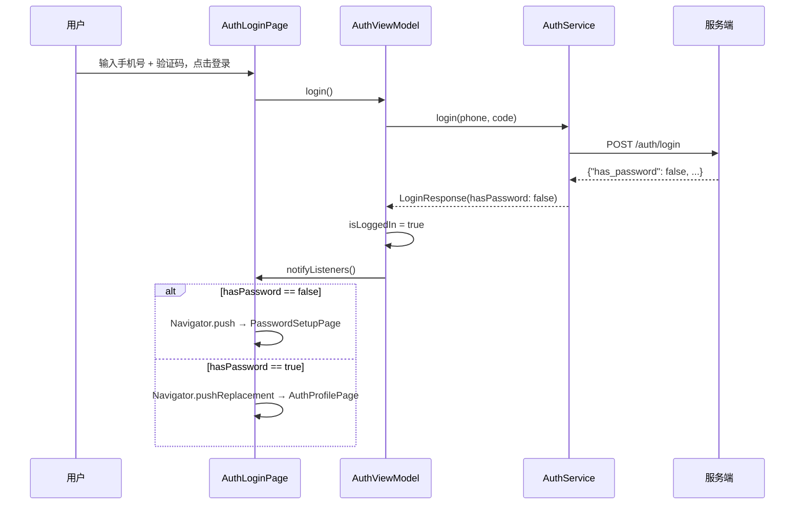
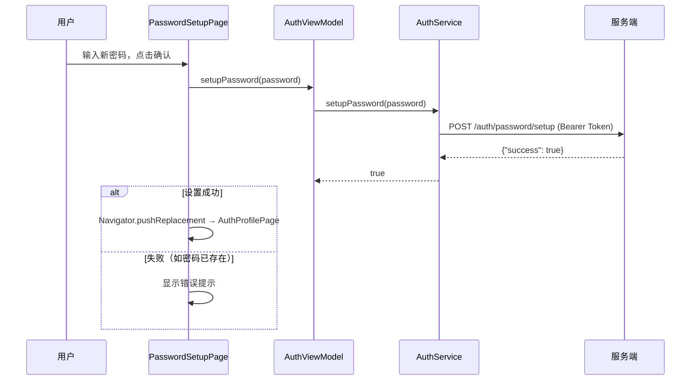
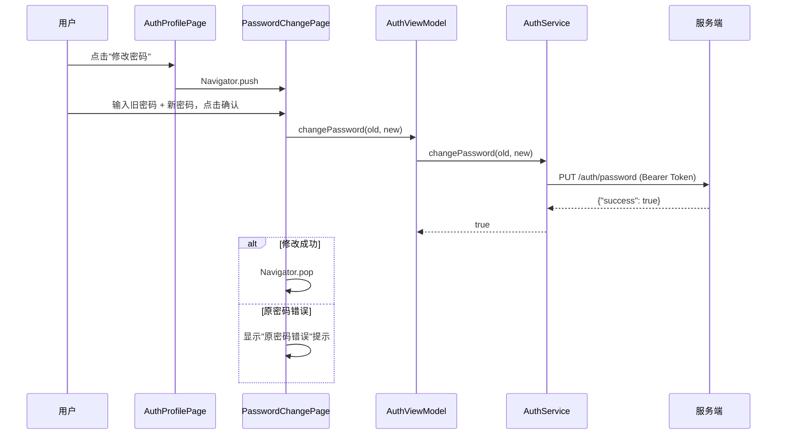

# 认证系统升级 — 客户端设计报告

## 1. 目标

- 登录响应解析新增的 `has_password` 字段
- 短信登录后，若未设置密码则引导至 **密码设置页**
- 新增 **密码设置页面**（设置初始密码）
- 在个人中心新增 **修改密码入口**，跳转到 **密码修改页面**
- 密码修改页面支持"输入旧密码 + 新密码"校验

## 2. 现状分析

### 2.1 已有能力

| 能力 | 实现 | 说明 |
|------|------|------|
| 短信登录页 | `AuthLoginPage` | 手机号 + 验证码输入 |
| 密码登录页 | `AuthLoginPage`（切换） | 手机号 + 密码输入 |
| 个人资料页 | `AuthProfilePage` | 头像、昵称、手机号展示 + 退出登录 |
| 登录模型 | `LoginResponse` | success / token / userId / nickname / avatar / message |
| 网络层 | `AuthService` (Dio) | sms / login / loginWithPassword / getProfile |
| 状态管理 | `AuthViewModel` (ChangeNotifier) | phone / code / password / isLoggedIn / profile |

### 2.2 存在的问题

- `LoginResponse` 缺少 `hasPassword` 字段，无法判断登录后是否需要设置密码
- 无密码设置/修改页面
- 短信注册的新用户 `password_hash` 为空，无法使用密码登录，也没有设置密码的入口

## 3. 数据模型与接口

### 3.1 模型变更

#### LoginResponse（变更）

```dart
class LoginResponse {
  final bool success;
  final String? loginType;
  final String? token;
  final int? userId;
  final String? nickname;
  final String? avatar;
  final bool hasPassword;    // 新增
  final String? message;

  // fromJson 中新增 has_password 解析
}
```

| 字段 | 类型 | 说明 |
|------|------|------|
| `hasPassword` | `bool` | **新增**。服务端返回 `has_password`，服务端不返回时默认 `false` |

#### UserProfile（变更）

```dart
class UserProfile {
  final int userId;
  final String nickname;
  final String avatar;
  final String phone;
  final bool hasPassword;    // 新增

  // fromJson 中新增 has_password 解析
}
```

### 3.2 接口契约（客户端侧）

客户端新增调用的 API（已在服务端设计报告中定义）：

| 方法 | 路径 | 鉴权 | 说明 |
|------|------|------|------|
| POST | `/auth/password/setup` | Bearer | 设置初始密码 |
| PUT | `/auth/password` | Bearer | 修改密码 |

### 3.3 配置变更

`AuthConfig` 新增路径常量：

```dart
static const String passwordSetupPath = '/auth/password/setup';
static const String passwordChangePath = '/auth/password';
```

## 4. 核心流程

### 4.1 短信登录 → 密码设置引导



### 4.2 设置密码



### 4.3 修改密码



## 5. 项目结构与技术决策

### 5.1 项目结构

```
flash_im/lib/src/playground/features/auth/
├── config/
│   └── auth_config.dart            # 新增 passwordSetupPath / passwordChangePath
├── models/
│   ├── login_type.dart             # 不变
│   ├── login_response.dart         # 新增 hasPassword 字段
│   └── user_profile.dart           # 新增 hasPassword 字段
├── services/
│   └── auth_service.dart           # 新增 setupPassword / changePassword 方法
├── viewmodel/
│   └── auth_viewmodel.dart         # 新增 setupPassword / changePassword
└── views/
    ├── auth_login_page.dart        # 登录后根据 hasPassword 跳转
    ├── auth_profile_page.dart      # 新增"修改密码"入口
    ├── password_setup_page.dart    # [新增] 设置初始密码页
    └── password_change_page.dart   # [新增] 修改密码页
```

### 5.2 职责划分

```
View 层:
  AuthLoginPage ─── 登录后根据 hasPassword 跳转
    ├── false → PasswordSetupPage
    └── true  → AuthProfilePage

  AuthProfilePage ─── 新增"修改密码"项目 → 跳转 PasswordChangePage

  PasswordSetupPage ─── [新增] 输入新密码 → AuthViewModel.setupPassword()
  PasswordChangePage ─── [新增] 输入旧+新密码 → AuthViewModel.changePassword()

ViewModel 层:
  AuthViewModel
    ├── 新增 hasPassword getter（从 LoginResponse 中获取）
    ├── 新增 setupPassword(String password)
    └── 新增 changePassword(String oldPwd, String newPwd)

Service 层:
  AuthService
    ├── 新增 setupPassword(String password)
    └── 新增 changePassword(String oldPwd, String newPwd)
```

### 5.3 技术决策

| 决策 | 方案 | 理由 |
|------|------|------|
| 密码设置页风格 | 微信风格弹窗页 | 与现有登录/个人中心 UI 统一 |
| hasPassword 存储 | 仅从服务端获取，不本地持久化 | 单一数据源，避免本地过期 |
| 密码设置成功跳转 | `Navigator.pushReplacement` 到 ProfilePage | 设置后不应回退到设置页 |
| 修改密码成功跳转 | `Navigator.pop` 退回 ProfilePage | 返回上一页是自然行为 |

### 5.4 UI 设计要点

**PasswordSetupPage（设置密码页）**
- 标题：「设置密码」
- 说明文案：「为保障账号安全，请设置登录密码」
- 输入框：新密码（6 位以上，密码输入类型）
- 确认密码：二次输入，校验是否一致
- 按钮：「确认设置」
- 跳过按钮：「暂不设置」（跳转到 ProfilePage）

**PasswordChangePage（修改密码页）**
- 标题：「修改密码」
- 输入框 1：原密码
- 输入框 2：新密码
- 输入框 3：确认新密码
- 按钮：「确认修改」

## 6. 暂不实现

| 功能 | 理由 |
|------|------|
| 密码强度指示器（弱/中/强） | 额外 UI 复杂度，后续优化 |
| 忘记密码 / 短信重置密码 | 需要独立的流程设计，本版本聚焦"设置+修改" |
| 密码设置引导的动画效果 | 非功能性 |
| 生物特征登录（指纹/面容） | 平台差异大，后续版本 |
