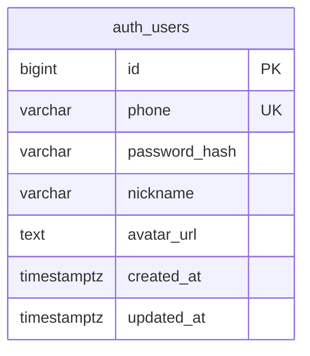
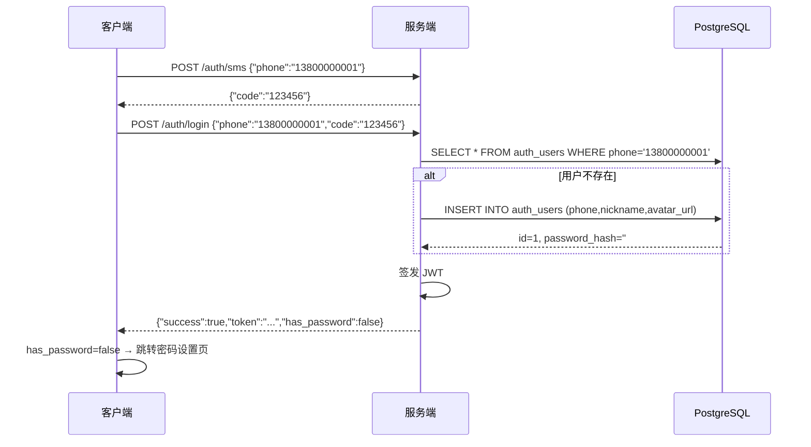
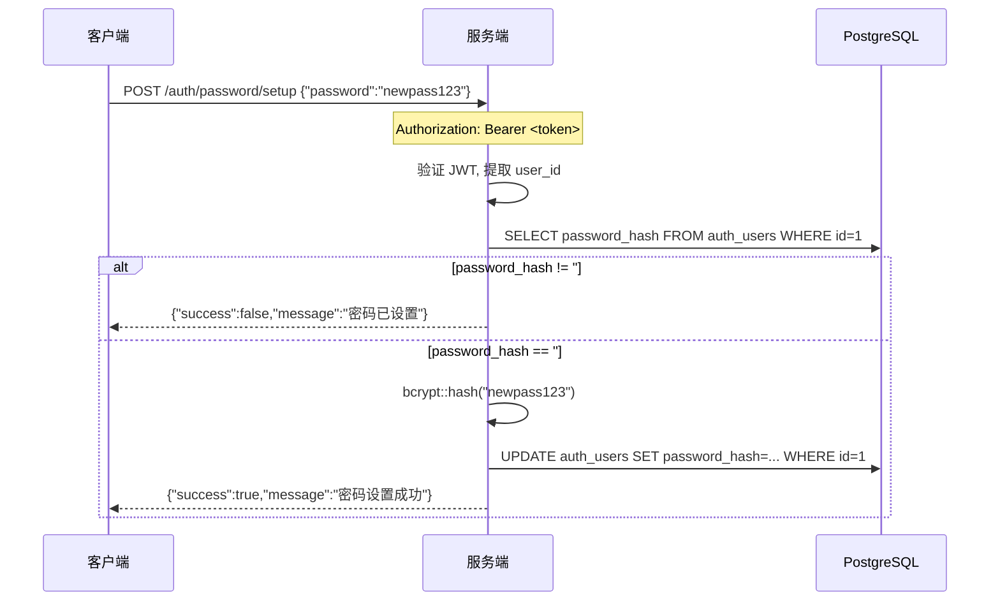
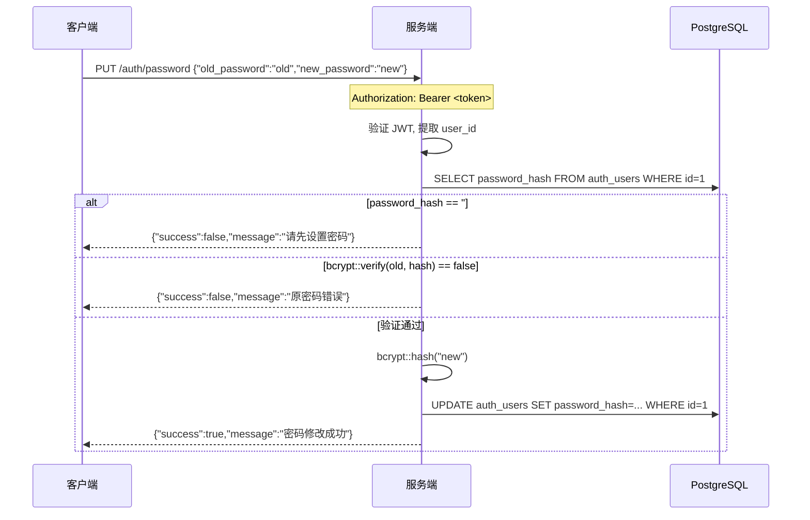
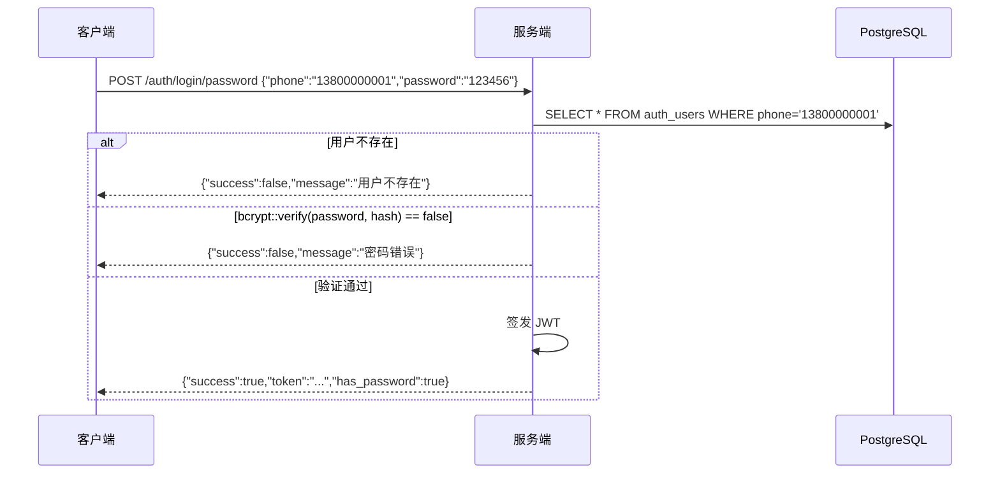

# 认证系统升级 — 服务端设计报告

## 1. 目标

- 将用户数据从内存 `HashMap` 迁移到 PostgreSQL 持久化存储
- 新增 **设置密码** 接口（短信登录后引导设置）
- 新增 **修改密码** 接口（已设置密码的用户修改密码）
- 登录响应中增加 `has_password` 字段，供客户端判断是否引导设置密码

## 2. 现状分析

### 2.1 已有能力

| 能力 | 实现 | 说明 |
|------|------|------|
| 短信验证码 | `POST /auth/sms` | 返回 6 位随机验证码，5 分钟有效 |
| 短信登录 | `POST /auth/login` | 验证码校验通过后签发 JWT，新用户自动注册 |
| 密码登录 | `POST /auth/login/password` | 手机号 + 密码校验 |
| 用户信息 | `GET /user/profile` | Bearer Token 鉴权 |
| JWT | `auth/jwt.rs` | 签发 / 校验，2 小时有效期 |

### 2.2 存在的问题

- **数据易失**：`AppState.users: HashMap<String, User>` 纯内存存储，重启全部丢失
- **密码为空用户无法设密码**：`User::from_sms()` 创建的用户 `password_hash` 为空，`verify_password()` 对空密码永远返回 `false`，此类用户永远无法使用密码登录
- **缺少密码管理接口**：无设置密码、修改密码接口
- **简单哈希**：`simple_hash()` 使用 `DefaultHasher`（非加密哈希），生产环境不安全

### 2.3 基础设施就绪

| 基础设施 | 状态 | 说明 |
|----------|------|------|
| PostgreSQL 18 | ✅ 已安装运行 | 端口 5432，用户 postgres |
| Rust 编译环境 | ✅ 就绪 | stable-x86_64-pc-windows-msvc |
| 项目已有模块化结构 | ✅ | `auth/`、`ws/`、`mock/`、`util/`、`state.rs` |

## 3. 数据模型与接口

### 3.1 数据模型

#### 数据库表（PostgreSQL）

**命名规范**：`{module}_{entity}`，模块前缀区分职责域。

```sql
-- 认证模块：用户账号表
CREATE TABLE auth_users (
    id            BIGSERIAL PRIMARY KEY,
    phone         VARCHAR(20)  NOT NULL UNIQUE,
    password_hash VARCHAR(255) NOT NULL DEFAULT '',
    nickname      VARCHAR(50)  NOT NULL DEFAULT '',
    avatar_url    TEXT         NOT NULL DEFAULT '',
    created_at    TIMESTAMPTZ  NOT NULL DEFAULT NOW(),
    updated_at    TIMESTAMPTZ  NOT NULL DEFAULT NOW()
);

CREATE UNIQUE INDEX idx_auth_users_phone ON auth_users (phone);
```

#### ER 关系图



#### 关键设计决策

| 决策 | 方案 | 理由 |
|------|------|------|
| 主键类型 | `BIGSERIAL` / `i64` | 与 JWT Claims 的 `user_id: u64` 对齐，自增避免冲突 |
| 密码哈希 | bcrypt (`password-hash` crate) | 替代当前 `simple_hash()`，生产级安全 |
| 空密码表示 | `password_hash = ""` | 区分"从未设过密码"和"密码为空"两种状态 |
| Rust 侧映射 | 直接 SQL 查询 + 手工结构体 | 当前规模小，不引入 ORM 额外复杂度 |
| 连接池 | sqlx 内置 `PgPool` | 异步安全、编译时查询检查 |

### 3.2 接口契约

#### 接口速览

| 方法 | 路径 | 鉴权 | 说明 |
|------|------|------|------|
| POST | `/auth/sms` | 无 | 发送短信验证码（不变） |
| POST | `/auth/login` | 无 | 短信登录（响应增加 has_password） |
| POST | `/auth/login/password` | 无 | 密码登录（响应增加 has_password） |
| GET | `/user/profile` | Bearer | 用户信息（响应增加 has_password） |
| POST | `/auth/password/setup` | Bearer | 设置初始密码 |
| PUT | `/auth/password` | Bearer | 修改密码 |

---

#### POST /auth/login（短信登录，变更）

**变更说明**：响应中增加 `has_password` 字段。

**请求**（不变）

```json
{
  "phone": "13800000001",
  "code": "123456"
}
```

**响应 200**

```json
{
  "success": true,
  "login_type": "sms",
  "token": "eyJ...",
  "user_id": 1,
  "nickname": "13800000001",
  "avatar": "https://api.dicebear.com/7.x/identicon/png?seed=13800000001",
  "has_password": false,
  "message": null
}
```

**响应字段变更**

| 字段 | 类型 | 说明 |
|------|------|------|
| `has_password` | `bool` | **新增**。`true` = 已设置密码，`false` = 需引导设置 |

---

#### POST /auth/login/password（密码登录，变更）

**变更说明**：响应中增加 `has_password` 字段（密码登录必然是 `true`）。

**响应 200**

```json
{
  "success": true,
  "login_type": "password",
  "token": "eyJ...",
  "user_id": 1,
  "nickname": "Alice",
  "avatar": "https://...",
  "has_password": true,
  "message": null
}
```

---

#### GET /user/profile（变更）

**变更说明**：响应中增加 `has_password` 字段。

**响应 200**

```json
{
  "success": true,
  "user_id": 1,
  "nickname": "Alice",
  "avatar": "https://...",
  "phone": "13800000001",
  "has_password": true,
  "message": null
}
```

---

#### POST /auth/password/setup（新增）

**说明**：为从未设置过密码的用户设置初始密码。要求用户当前密码为空。需要 Bearer Token 鉴权。

**请求**

```json
{
  "password": "newpass123"
}
```

**校验规则**

| 规则 | 错误信息 |
|------|----------|
| `password` 长度 ≥ 6 | "密码长度不能少于 6 位" |
| 当前用户 `password_hash` 为空 | "密码已设置，请使用修改密码接口" |

**响应 200（成功）**

```json
{
  "success": true,
  "message": "密码设置成功"
}
```

**响应 200（失败 — 密码已存在）**

```json
{
  "success": false,
  "message": "密码已设置，请使用修改密码接口"
}
```

**错误码**

| 状态码 | 场景 |
|--------|------|
| 401 | Token 无效或过期 |

---

#### PUT /auth/password（新增）

**说明**：修改已有密码。要求提供旧密码验证。需要 Bearer Token 鉴权。

**请求**

```json
{
  "old_password": "oldpass123",
  "new_password": "newpass456"
}
```

**校验规则**

| 规则 | 错误信息 |
|------|----------|
| `new_password` 长度 ≥ 6 | "新密码长度不能少于 6 位" |
| `old_password` 与当前密码不匹配 | "原密码错误" |
| 当前用户 `password_hash` 为空 | "请先设置密码" |

**响应 200（成功）**

```json
{
  "success": true,
  "message": "密码修改成功"
}
```

**响应 200（失败 — 原密码错误）**

```json
{
  "success": false,
  "message": "原密码错误"
}
```

## 4. 核心流程

### 4.1 短信登录 → 引导设置密码



### 4.2 设置密码



### 4.3 修改密码



### 4.4 密码登录



## 5. 项目结构与技术决策

### 5.1 项目结构

```
im-server/src/
├── main.rs              # 组装路由，启动服务（注入 PgPool）
├── state.rs             # 共享状态（HashMap → PgPool，移除 users/sms_codes HashMap）
├── db.rs                # [新增] 数据库连接池 + 迁移
├── auth/
│   ├── mod.rs           # 路由注册（新增 password setup/modify 路由）
│   ├── jwt.rs           # JWT 签发/校验（不变）
│   ├── sms.rs           # 短信验证码（增加 Redis/内存兼容，或保留内存）
│   ├── password.rs      # 密码登录 + 设置/修改密码（重写为 DB 查询）
│   └── user.rs          # 短信登录 + 用户信息（重写为 DB 查询）
├── migrations/           # [新增] sqlx 迁移文件
│   ├── 20260519000000_create_auth_users.sql
│   └── 20260519000001_seed_auth_users.sql
├── ws/                  # WebSocket（不变）
├── mock/                # 模拟数据（不变）
└── util/                # 工具（不变）

项目根目录还包含数据库管理脚本（不在 src 内）：
scripts/
├── setup/
│   └── install_sqlx.ps1    # 检测并安装 sqlx-cli
└── db/
    ├── init.ps1             # 创建数据库 + 运行迁移
    ├── clean.ps1            # 清空所有表数据
    └── reset.ps1            # 重建数据库（drop + init）
```

### 5.2 职责划分

```
HTTP Router
  ├── /auth/sms        → sms::send_sms       (读/写 sms_codes 内存表)
  ├── /auth/login      → user::login         (读/写 auth_users 表)
  ├── /auth/login/password → password::login (读 auth_users 表)
  ├── /auth/password/setup  → password::setup(读/写 auth_users 表)  [新增]
  ├── /auth/password   → password::change    (读/写 auth_users 表)  [新增]
  └── /user/profile    → user::get_profile   (读 auth_users 表)
```

- `AppState` 不再持有 `users: HashMap`，改为持有 `pool: PgPool`
- `sms_codes` 验证码仍暂存内存（后续版本迁移到 Redis）

### 5.3 技术决策

| 决策 | 方案 | 理由 |
|------|------|------|
| 数据库驱动 | `sqlx` (v0.8+) | 编译时 SQL 校验、异步、零成本抽象 |
| 密码哈希 | `bcrypt` | 行业标准，Rust 生态成熟 |
| Seed 用户 | SQL 迁移脚本初始化 | 替代当前 `seed_users()` 硬编码 |
| 验证码存储 | 保持内存 `HashMap` | 改动范围最小，后续迁移 Redis |
| ORM | 不使用 | 当前表数量少，手写 SQL 更可控 |
| 迁移方式 | sqlx migrate | 内置迁移工具，自动建表 |

### 5.4 新增依赖

| 依赖 | 用途 | 说明 |
|------|------|------|
| `sqlx` (features: postgres, runtime-tokio, migrate) | 异步 PostgreSQL 驱动 | 需新增 |
| `bcrypt` | 密码哈希 | 替代当前 simple_hash |
| `dotenvy` | 读取 `.env` 配置 | 管理数据库连接字符串 |

## 6. 暂不实现

| 功能 | 理由 |
|------|------|
| 验证码存入 Redis | 当前内存 HashMap 够用，后续统一存储层 |
| 数据库连接 TLS | 本地开发环境不需要 |
| 密码强度策略（大小写+特殊符号） | 当前阶段仅校验最小长度 6 |
| 密码错误次数限制 / 锁定 | 安全增强，非核心功能 |
| 手机号格式校验 | 前端已有 11 位校验，后端暂不做严格正则 |
| 多设备登录 / 会话管理 | 复杂度高，后续版本规划 |
