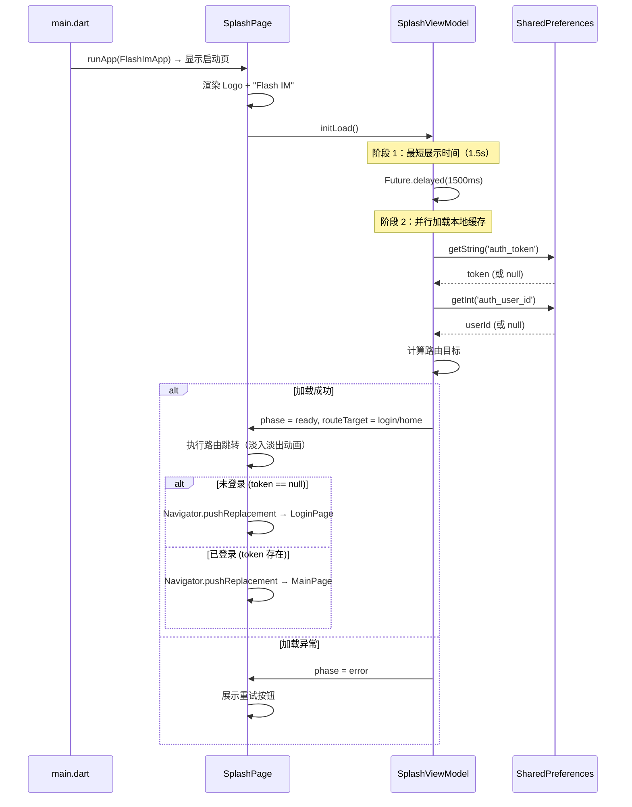

# 启动页 — 客户端设计报告

## 1. 目标

- 提供品牌启动页：展示 Logo + "Flash IM" 文字，建立品牌认知
- 加载本地持久化的配置与缓存资源（Token、用户 ID 等认证数据）
- 根据认证状态自动路由到不同目标页（已登录 → 主页 / 未登录 → 登录页）
- 作为脱离 Playground 的**正式 App 入口**，替换默认的 `main.dart` 计数器页面

## 2. 现状分析

### 2.1 已有能力

| 能力 | 实现 | 说明 |
|------|------|------|
| Token 持久化 | `AuthService` (SharedPreferences) | 存储 auth_token / auth_user_id |
| 登录状态判断 | `AuthService.isLoggedIn()` | 检查 Token 是否存在且非空 |
| 认证 UI | Playground 下的 AuthLoginPage / AuthProfilePage | 可在正式 App 中复用 |
| 网络层 | Dio + AuthConfig | 已封装基础请求能力 |

### 2.2 存在的问题

- **无正式 App 入口**：`main.dart` 仍为 Flutter 默认计数器 demo，Playground 通过 `main_playground.dart` 独立入口运行
- **无启动流程**：缺乏启动加载 → 路由分发的标准化流程
- **无品牌展示**：App 启动直接进入功能页，缺乏品牌曝光
- **缓存加载时机不明确**：Token 在 AuthService 各方法中按需读取，无集中初始化

### 2.3 基础设施

| 项目 | 状态 | 说明 |
|------|------|------|
| SharedPreferences | 已有 | 用于存储 Token / userId |
| 图片资源目录 | 需创建 | Logo 由用户提供，放入 `assets/images/` |
| app 层目录 | 需创建 | `lib/src/app/` 用于正式 App 代码，与 playground 平级 |

## 3. 数据模型与接口

### 3.1 启动状态枚举

```dart
/// 启动阶段
enum SplashPhase {
  initializing,    // 正在初始化（加载配置/缓存）
  ready,           // 就绪，准备跳转
  error,           // 加载异常
}
```

### 3.2 路由目标枚举

```dart
/// 启动完成后的跳转目标
enum SplashRouteTarget {
  login,           // 未登录 → 登录页
  home,            // 已登录 → 主页
}
```

### 3.3 启动加载结果

```dart
class SplashLoadResult {
  final bool isLoggedIn;
  final int? userId;
  final String? errorMessage;

  const SplashLoadResult({
    required this.isLoggedIn,
    this.userId,
    this.errorMessage,
  });

  SplashRouteTarget get routeTarget =>
      isLoggedIn ? SplashRouteTarget.home : SplashRouteTarget.login;
}
```

| 决策 | 理由 |
|------|------|
| 不做网络健康检查（ping 服务器） | 启动阶段应追求极速，网络探测放到登录后的心跳模块处理 |
| 不做版本号/强制更新检查 | 本版本聚焦基础启动流程，后续版本扩展 |
| Token 仅检查存在性，不验证有效性 | JWT 过期校验由服务端在后续 API 调用时负责，避免启动时额外网络请求 |

### 3.4 接口契约

本模块**不涉及网络请求**，所有操作均为本地同步/异步读取：

| 操作 | 来源 | 说明 |
|------|------|------|
| 读取 Token | SharedPreferences (`auth_token`) | 判断登录态 |
| 读取 userId | SharedPreferences (`auth_user_id`) | 记录登录用户 |

### 3.5 资源清单

| 资源 | 路径 | 说明 |
|------|------|------|
| Logo 图片 | `assets/images/logo.png` | 由用户提供，用于启动页展示 |

## 4. 核心流程

### 4.1 启动 → 路由分发（主流程）



### 4.2 时序约束

```mermaid
gantt
    title 启动加载时序
    dateFormat X
    axisFormat %S

    section 启动页展示
    品牌 Logo 展示      :a1, 0, 1500ms
    淡出动画            :a2, 1400, 100ms

    section 缓存加载
    读取 auth_token     :b1, 1200, 100ms
    读取 auth_user_id   :b2, 1300, 50ms
    计算路由目标        :b3, 1350, 50ms
    路由跳转            :b4, 1500, 100ms
```



**关键规则**：
- 启动页**最短展示 1.5 秒**，避免闪屏体验
- 缓存读取在展示期间**并行进行**，不阻塞动画
- 路由跳转使用 `pushReplacement`，**不可回退到启动页**
- 若加载失败，启动页**不自动跳转**，展示重试按钮

## 5. 项目结构与技术决策

### 5.1 项目结构

```
flash_im/
├── assets/
│   └── images/
│       └── logo.png                            # [新增] 品牌 Logo（用户提供）
├── lib/
│   ├── main.dart                               # [修改] 正式 App 入口，挂载 SplashPage
│   └── src/
│       ├── app/                                # [新增] 正式 App 代码目录
│       │   └── splash/                         # [新增] 启动模块
│       │       ├── config/
│       │       │   └── splash_config.dart      # 启动页配置（最短展示时长、路径等）
│       │       ├── models/
│       │       │   └── splash_state.dart       # 启动状态枚举 + 加载结果模型
│       │       ├── services/
│       │       │   └── splash_service.dart     # 缓存读取、初始化逻辑
│       │       ├── viewmodel/
│       │       │   └── splash_viewmodel.dart   # 启动状态管理（ChangeNotifier）
│       │       └── views/
│       │           └── splash_page.dart        # 启动页 UI（Logo + 文字 + 加载指示）
│       └── playground/                         # Playground 代码（不变）
│           └── ...
└── docs/
    └── features/
        └── splash/
            ├── README.md                       # 模块总览
            ├── roadmap.md                      # 演进路线
            └── v1.0/
                └── client/
                    └── design.md               # 本文档
```

### 5.2 职责划分

```
View 层:
  SplashPage ─── 纯 UI 展示 + 动画，监听 ViewModel
    ├── Logo 图片展示（用户提供）
    ├── "Flash IM" 文字标题
    ├── 底部加载指示器（可选）
    └── 错误状态 → 展示重试按钮

ViewModel 层:
  SplashViewModel (ChangeNotifier)
    ├── 持有 SplashPhase 状态
    ├── 持有 SplashRouteTarget（加载完成后确定）
    ├── initLoad() → 启动加载流程（延迟 + 读缓存）
    ├── retry()    → 重试加载
    └── 暴露 phase / routeTarget / errorMessage 给 View

Service 层:
  SplashService
    ├── loadAuthToken()    → 从 SharedPreferences 读取 token
    ├── loadUserId()       → 从 SharedPreferences 读取 userId
    └── checkLoginStatus() → 综合判断是否已登录

Config 层:
  SplashConfig
    ├── minDisplayDuration → 最短展示时长
    └── logoPath           → Logo 资源路径
```

**依赖方向**：`View → ViewModel → Service → SharedPreferences`（单向，与现有 Auth 模块一致）

### 5.3 技术决策

| 决策 | 方案 | 理由 |
|------|------|------|
| 状态管理 | ChangeNotifier | 与项目现有 Auth / Heartbeat 模块保持一致 |
| 路由跳转 | `Navigator.pushReplacement` | 启动页不应留在回退栈中 |
| 最短展示时间 | 1.5 秒 | 品牌曝光 + 避免闪屏，通用 App 启动页标准 |
| 跳转动画 | 淡入淡出（FadeTransition） | 平滑过渡，体感自然 |
| Logo 格式 | PNG | 支持透明通道，适配不同背景 |
| 缓存服务复用 | 直接使用 SharedPreferences（不新建封装） | 与 AuthService 的存储方式兼容，避免迁移成本 |
| 无网络请求 | 启动阶段零网络调用 | 降低启动失败率，保持极速启动体验 |
| 加载失败策略 | 展示错误信息 + 重试按钮 | 不给用户一个无法操作的死页面 |

| 依赖 | 用途 | 已有 / 需新增 |
|------|------|-------------|
| `shared_preferences` | 读取本地 Token | 已有 |
| `flutter` SDK | UI、动画、路由 | 已有 |

### 5.4 main.dart 变更

```
当前：
  main.dart → runApp(MyApp) → MaterialApp → MyHomePage (计数器)

变更后：
  main.dart → runApp(FlashImApp) → MaterialApp → SplashPage (启动页)
    ├── 已登录 → MainPage (空白占位)
    └── 未登录 → LoginPage (空白占位)
```

`main.dart` 中不再包含计数器 demo 代码。Playground 入口保留在 `main_playground.dart` 中，二者互不影响。

### 5.5 UI 设计要点

**SplashPage（启动页）**
- 背景：纯白色，简洁大方
- 布局：垂直居中
  - Logo 图片（用户提供，建议 120x120 以上）
  - Logo 下方间距 24px
  - "Flash IM" 文字（深色，字重 700，字号 28）
  - 最下方：CircularProgressIndicator（加载中）或 "重试" 按钮（错误时）
- 动画：
  - Logo 带轻微缩放入场动画（scale 0.8 → 1.0，时长 800ms）
  - 文字带淡入 + 上移动画（opacity 0→1，offset 20→0，时长 600ms）
- 错误状态：
  - 隐藏加载指示器
  - 展示错误文案 + 重试按钮

## 6. 暂不实现

| 功能 | 理由 |
|------|------|
| 服务端版本检查 / 强制更新 | 需要服务端配合，后续版本 |
| Token 有效性校验（网络请求） | 启动阶段追求极速，由后续 API 调用时自然触发 401 刷新 |
| 引导页 / Onboarding | 独立的交互设计，需要产品定义，后续版本 |
| 广告页（Ad Splash） | 需接入广告 SDK，非本阶段目标 |
| 网络状态预检 | 由心跳模块负责，启动页不做额外网络请求 |
| 闪屏图片可配置（服务端下发） | 需要管理后台支持，后续版本 |
| 暗色模式适配 | 当前仅亮色模式，后续统一处理 |