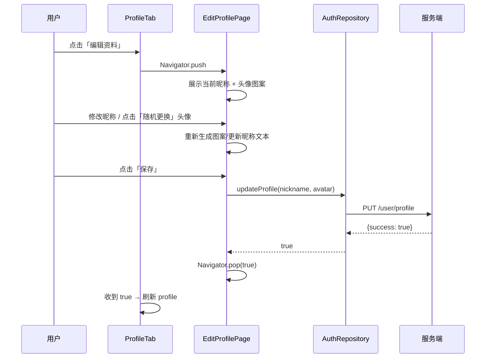
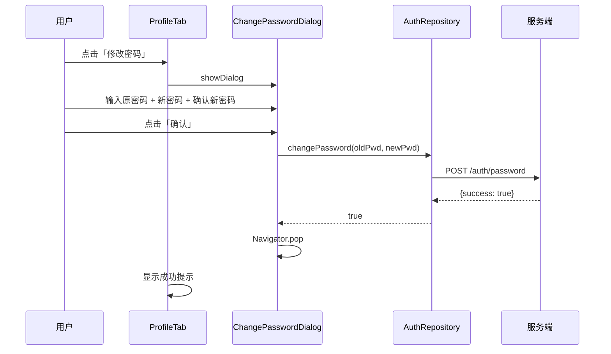
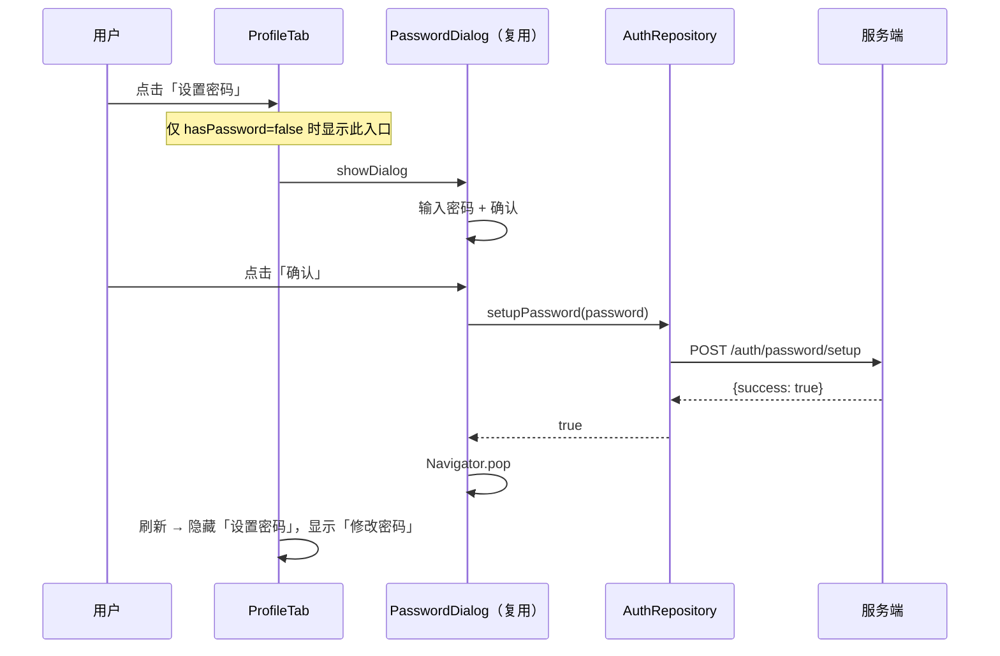

# 用户个人信息编辑 + 密码管理 — 客户端设计报告

## 1. 目标

- 在「我的」页面中新增**编辑个人信息**入口：修改昵称、选择/上传头像
- 默认头像从外部 URL 改为**本地生成的对称方块图案**，支持**随机更换**（点击生成新图案）
- **设置密码**：未设置密码的用户可在 ProfileTab 中设置（复用已有 setup 流程）
- **修改密码**：已设置密码的用户可修改密码（需原密码），与设置密码流程独立
- 编辑后返回「我的」页面自动刷新

## 2. 现状分析

### 2.1 已有能力

| 能力 | 位置 | 说明 |
|------|------|------|
| ProfileTab | `app/home/views/profile_tab.dart` | 展示用户昵称、头像、信息卡片、退出登录 |
| AuthRepository | `modules/flash_auth` | `getProfile()`、`setupPassword()`、token 管理 |
| AuthApiService | `modules/flash_auth` | 封装 Dio 的 REST 调用 |
| 密码设置弹窗 | `modules/flash_auth` 的 `PasswordDialog` | 登录后 `hasPassword=false` 时弹出 |
| 后端 `/auth/password` | `im-server` | `POST /auth/password` 已实现修改密码接口（需 `old_password`+`new_password`） |

### 2.2 存在的问题

- ProfileTab 仅展示信息，无编辑入口
- 默认头像依赖外部 URL（`dicebear/identicon`），无网络时不可用，且无法随机更换
- 客户端未实现 `changePassword` 调用（后端接口已就绪）
- 后端缺少 `PUT /user/profile` 更新昵称/头像接口（需新增）
- 设置密码入口只在登录后弹窗中出现一次，已跳过的用户无法再次设置

### 2.3 接口对照

| 接口 | Server 状态 | Client 状态 |
|------|------------|-------------|
| `GET /user/profile` | 已实现 | 已实现 (`getProfile`) |
| `POST /auth/password/setup` | 已实现 | 已实现 (`setupPassword`) |
| `POST /auth/password`（修改密码） | 已实现 | **未实现** |
| `PUT /user/profile`（更新资料） | **未实现** | **未实现** |

## 3. 数据模型与接口

### 3.1 默认头像方案：对称方块图案

不使用外部 URL 生成头像。改为在客户端本地用 `CustomPainter` 绘制**轴对称方块图案**：

```
4×4 对称方块图案示例：
┌──┬──┬──┬──┐
│  │██│██│  │
├──┼──┼──┼──┤
│██│  │  │██│
├──┼──┼──┼──┤
│██│  │  │██│
├──┼──┼──┼──┤
│  │██│██│  │
└──┴──┴──┴──┘
```

**设计要点：**
- 使用 6×6 网格，每格为方块
- **水平轴对称**：左半边绘制后镜像到右半边
- **配色**：统一使用 App 主题色 `0xFF4F46E5`（实心） + 白色背景（空心）
- 基于 `userId` 作为初始种子，生成伪随机图案（不同用户看到不同图案）
- 点击头像时重新生成随机种子，切换新图案
- 编辑页中显示当前图案 +「随机更换」按钮

| 决策 | 方案 | 理由 |
|------|------|------|
| 图案生成方式 | 客户端 Canvas 绘制 | 无网络依赖，即时渲染 |
| 对称方式 | 水平轴对称 | 视觉简洁，实现简单 |
| 网格尺寸 | 6×6 | 提供足够的变化自由度 |
| 配色 | 主题色 + 白色 | 与整体 UI 风格一致 |
| 随机种子 | `Random(int seed)` | 可复现，按 userId 初始化 |

**头像状态模型：**

```dart
// 头像数据 — 区分系统默认图案 vs 用户自定义头像
enum AvatarType { pattern, customUrl }

class AvatarState {
  final AvatarType type;
  final int? patternSeed;      // type == pattern 时有效
  final String? customUrl;     // type == customUrl 时有效

  // 从 UserProfile 解析：avatar 为空或非 http → 使用 pattern + userId 作为默认种子
  factory AvatarState.fromProfile(UserProfile profile) { ... }
}
```

> `patternSeed` 持久化到后端，确保切换设备后头像一致。

### 3.2 新增服务端接口：PUT /user/profile

```
PUT /user/profile
Authorization: Bearer <token>

Request:
{
  "nickname": "新昵称",       // 可选
  "avatar": "数值或URL"       // 可选，patternSeed 或网络 URL
}

Response (200):
{
  "success": true,
  "message": "资料更新成功"
}

Error (400 / 401 / 500):
{
  "success": false,
  "message": "错误描述"
}
```

### 3.3 已有接口清单

| 方法 | 路径 | 说明 | 是否需要 token |
|------|------|------|---------------|
| GET | `/user/profile` | 获取用户信息 | 是 |
| PUT | `/user/profile` | **新增** — 更新昵称/头像 | 是 |
| POST | `/auth/password/setup` | 设置初始密码 | 是 |
| POST | `/auth/password` | 修改密码（需原密码） | 是 |

### 3.4 Client 端新增方法

```dart
// AuthApiService 新增
Future<bool> changePassword(String oldPassword, String newPassword, String token) async { ... }

Future<bool> updateProfile({String? nickname, String? avatar, required String token}) async { ... }
```

```dart
// AuthRepository 新增（封装 token 获取 + API 调用）
Future<bool> changePassword(String oldPassword, String newPassword) async { ... }

Future<bool> updateProfile({String? nickname, String? avatar}) async { ... }
```

## 4. 核心流程

### 4.1 编辑个人信息



### 4.2 修改密码



### 4.3 设置密码（已跳过用户补设）



| 决策 | 理由 |
|------|------|
| 设置密码复用已有 `PasswordDialog` | 避免重复代码，保持一致性 |
| 修改密码用新 `ChangePasswordDialog` | 字段差异大（需原密码），耦合反而增加复杂度 |
| 编辑资料用独立页面而非弹窗 | 内容较多（昵称 + 头像 + 随机更换），弹窗不够 |

## 5. 项目结构与技术决策

### 5.1 项目结构

```
modules/flash_auth/lib/src/              # [修改] flash_auth 模块
├── config/
│   └── api_config.dart                  # [修改] 新增 updateProfilePath / changePasswordPath
├── services/
│   └── auth_api_service.dart            # [修改] 新增 changePassword / updateProfile 方法
├── repositories/
│   └── auth_repository.dart             # [修改] 新增 changePassword / updateProfile 方法
├── views/
│   ├── login_page.dart                  # 不变
│   ├── password_dialog.dart             # 不变（复用为设置密码）
│   └── change_password_dialog.dart      # [新增] 修改密码弹窗
└── widgets/
    └── pattern_avatar.dart              # [新增] 对称方块图案头像组件

flash_im/lib/src/app/home/views/         # [修改] home 模块
├── profile_tab.dart                     # [修改] 新增编辑入口、密码入口、编辑回调刷新
├── edit_profile_page.dart               # [新增] 编辑资料页面
├── main_page.dart                       # 不变
├── messages_tab.dart                    # 不变
└── contacts_tab.dart                    # 不变
```

### 5.2 职责划分

```
View 层:
  ProfileTab ──────────── 入口
    ├── 根据 hasPassword 决定显示「设置密码」或「修改密码」
    ├── 「编辑资料」→ Navigator.push → EditProfilePage
    └── 编辑返回后刷新 profile

  EditProfilePage ─────── 编辑资料页
    ├── 昵称 TextField（初始值从 profile 读取）
    ├── PatternAvatar 组件（显示当前图案 / 可随机更换）
    ├── 「保存」按钮 → AuthRepository.updateProfile()
    └── 成功后 Navigator.pop(true)

  ChangePasswordDialog ── 修改密码弹窗
    ├── 原密码 / 新密码 / 确认新密码 三个输入框
    ├── 校验：新密码 ≥ 6 位，两次一致，原密码非空
    └── 调用 AuthRepository.changePassword()

  PatternAvatar ───────── 对称方块图案组件
    ├── 接收 seed: int 参数
    ├── CustomPainter 绘制轴对称方块图案
    ├── 向外暴露更改种子的回调

Repository 层:
  AuthRepository ──────── 新增方法
    ├── updateProfile({nickname, avatar}) → bool
    └── changePassword(oldPassword, newPassword) → bool

Service 层:
  AuthApiService ──────── 新增方法
    ├── updateProfile({nickname, avatar}, token) → bool
    └── changePassword(oldPassword, newPassword, token) → bool
```

依赖方向不变：View → Repository → ApiService → Dio

### 5.3 技术决策

| 决策 | 方案 | 理由 |
|------|------|------|
| 状态管理 | 无额外框架，setState + FutureBuilder | 与现有 app-auth 模块一致 |
| 编辑页返回刷新 | `Navigator.push` 等待 `pop(true)` 后重新 `getProfile` | 简单可靠，无需事件总线 |
| 头像持久化 | `patternSeed` 存到后端 `avatar_url` 字段 | 统一存储，无需额外字段 |
| 密码入口显示 | 读取 profile 中的 `hasPassword` 字段 | 已有字段，无需额外请求 |
| hasPassword 在 profile 中的字段 | 需要在 `UserProfile` 中新增该字段 | 当前 `UserProfile` 不含 `hasPassword` |

### 5.4 需要同步的服务端改动

| 改动 | 位置 | 说明 |
|------|------|------|
| 新增 `PUT /user/profile` | `server/modules/flash_auth/src/user.rs` | 接收 `nickname` / `avatar` 字段更新 |
| 路由注册 | `server/modules/flash_auth/src/lib.rs` | 添加 `.route("/user/profile", put(...))` |

> 注意：服务端任务清单不在本文档范围内，需另行编写 `server/tasks.md`。

## 6. UI 设计要点

### 6.1 ProfileTab 改动

在已有信息卡片下方新增操作入口：

```
┌─ ProfileTab ────────────────────┐
│         [头像图案]               │  ← PatternAvatar(size: 80)
│          昵称                    │
│         ID: xxx                 │
│ ┌─────────────────────────────┐ │
│ │ 📱 手机号    138xxxx       │ │
│ │ 🏷 昵称      xxx          │ │  ← 信息卡片（不变）
│ │ 🔗 头像      [图案]       │ │
│ └─────────────────────────────┘ │
│ ┌─────────────────────────────┐ │
│ │       ✏️ 编辑资料           │ │  ← 新增入口
│ └─────────────────────────────┘ │
│ ┌─────────────────────────────┐ │
│ │       🔒 修改密码  ←或→ 设置密码  │  ← 新增入口（根据状态切换）
│ └─────────────────────────────┘ │
│ ┌─────────────────────────────┐ │
│ │       🚪 退出登录           │ │  ← 已有
│ └─────────────────────────────┘ │
└─────────────────────────────────┘
```

背景色保持 `Color(0xFFF8F8F8)`。

### 6.2 EditProfilePage

- AppBar：标题「编辑资料」，左侧返回箭头
- 顶部居中：`PatternAvatar` 组件（大尺寸，如 100×100）
- 头像下方：「随机更换」文字按钮
- 昵称输入框：带标签「昵称」，初始值预填当前昵称
- 底部：「保存」按钮（满宽）

### 6.3 PatternAvatar 组件

- `StatelessWidget`，接收 `size`（默认 80）、`seed`（int）、`gridSize`（默认 6）
- 使用 `CustomPaint` + `PatternPainter extends CustomPainter`
- `PatternPainter.paint()` 逻辑：
  1. 以 `seed` 创建 `Random`
  2. 遍历左半边列（0 ~ gridSize/2），每行生成随机布尔值
  3. 绘制左半方格，同时镜像绘制右半方格
  4. 实心格用主题色 `0xFF4F46E5`，空心格用白色

### 6.4 ChangePasswordDialog

- 参考已有 `PasswordDialog` 样式
- 三个输入框：原密码、新密码、确认新密码
- 校验规则：新密码 ≥ 6 位，两次新密码一致，原密码非空
- 按钮：「取消」+「确认」

## 7. 暂不实现

| 功能 | 理由 |
|------|------|
| 从相册/相机选取图片作为自定义头像 | 需要引入 `image_picker` 依赖 + 文件上传接口，后续版本 |
| 邮箱绑定/修改 | 后端尚未支持 |
| 注销账号 | 需要后端支持 + 安全确认流程，后续版本 |
| 昵称校验（敏感词/长度限制） | 后端暂不校验，客户端只做非空校验 |
| 暗色模式下头像图案适配 | 全局暗色模式处理时统一适配 |
