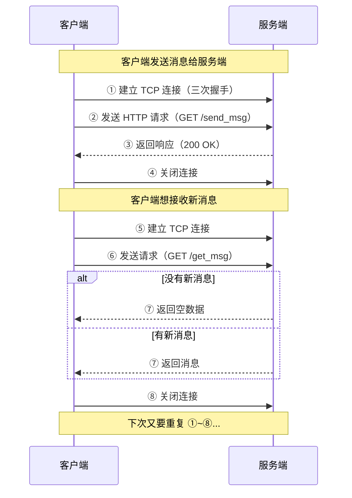
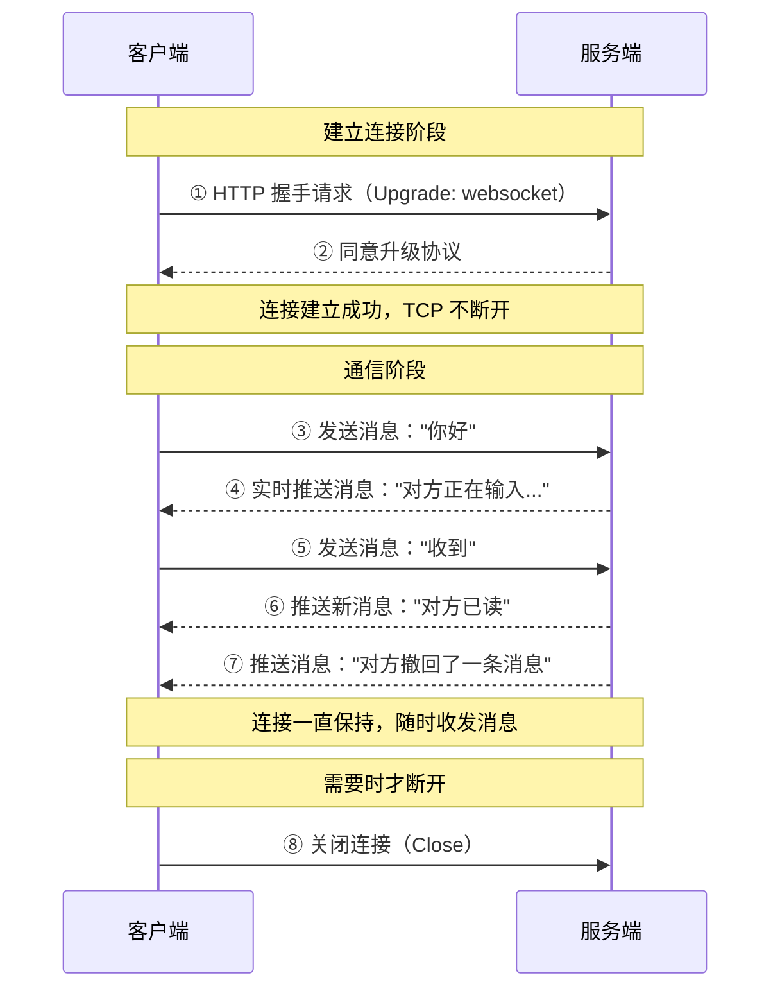
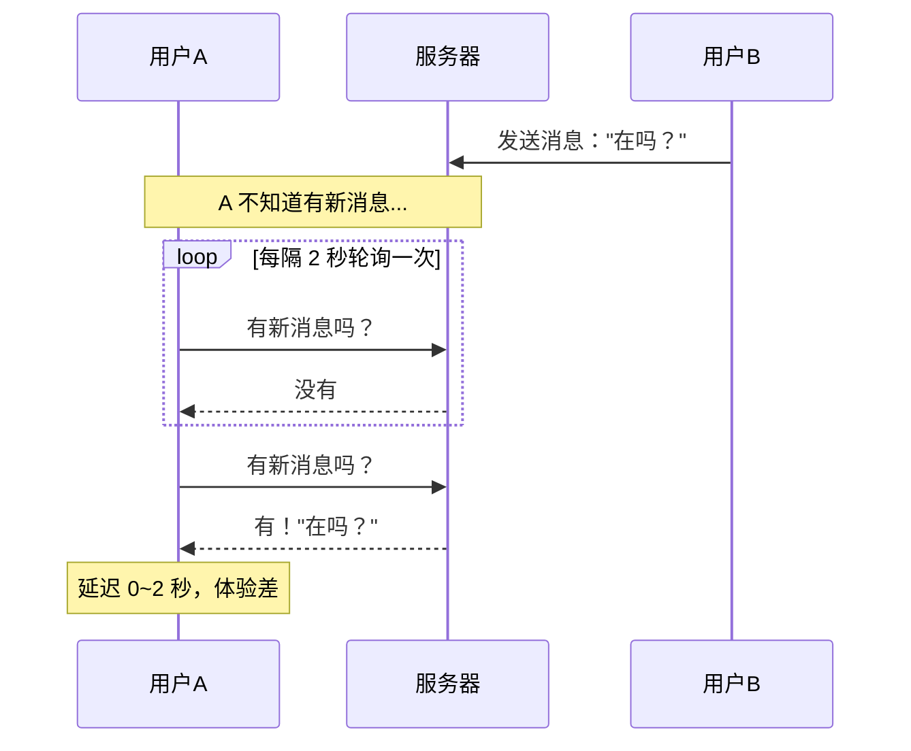
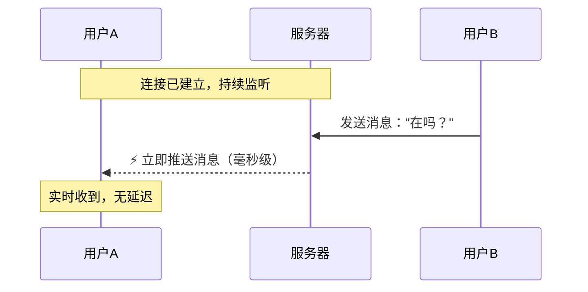
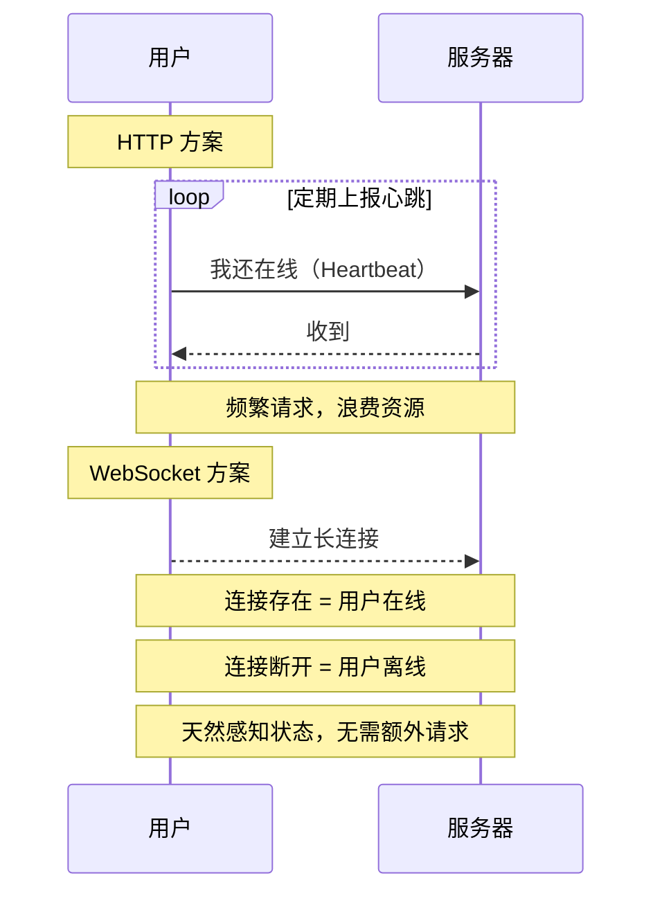
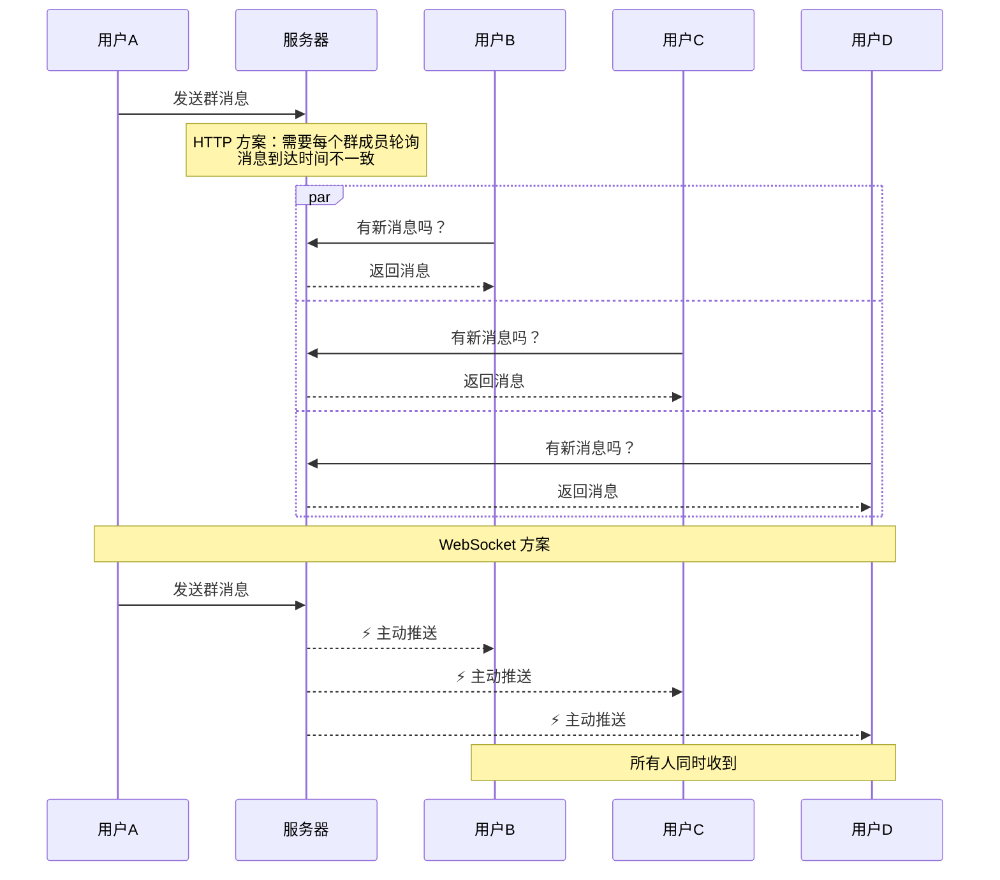
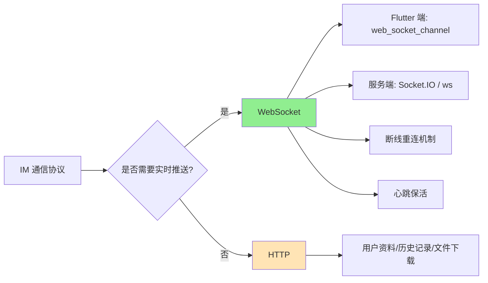

# HTTP vs WebSocket 对比研究

> 为什么即时通信（IM）产品必须使用 WebSocket

## 一、通俗比喻

| | HTTP | WebSocket |
|---|---|---|
| 比喻 | **打电话**：每次通话都要重新拨号，说完就挂断 | **对讲机**：建立连接后随时可以说话，一直保持通话状态 |
| 通信方式 | 你问我答，一问一答 | 随时互传消息，双向通道 |
| 连接 | 每次请求都新建连接，用完即关 | 建立一次连接，长期保持 |

## 二、通信流程对比

### HTTP 通信流程（短连接）

### WebSocket 通信流程（长连接）

## 三、核心区别

| 维度 | HTTP | WebSocket |
|---|---|---|
| **连接方式** | 短连接，每次请求新建 | 长连接，建立后持续保持 |
| **通信方向** | 单向（客户端发起，服务端响应） | 双向（两端随时主动发消息） |
| **协议** | 应用层协议 | 基于 TCP，独立协议 |
| **头部大小** | 大（每次带完整 Header，几 KB） | 小（仅 2~14 字节帧头） |
| **实时性** | 差（依赖轮询，有延迟） | 好（毫秒级推送） |
| **服务端主动推送** | 不支持 | 原生支持 |
| **适用场景** | 网页浏览、表单提交、RESTful API | 实时聊天、在线游戏、直播弹幕 |

## 四、为什么 IM 必须用 WebSocket

### 4.1 场景 1：收消息

**HTTP 方案（轮询）的困境：**

- 轮询间隔短 = 耗电耗流量
- 轮询间隔长 = 消息延迟大
- 大量无效请求，服务器压力大

**WebSocket 方案：**

- 服务端有新消息时**主动推送**
- 零延迟，毫秒级到达
- 无多余请求，省流量省电

### 4.2 场景 2：在线状态

### 4.3 场景 3：群聊消息广播

## 五、性能对比

### 消息到达延迟

| 方案 | 平均延迟 | 最大延迟 |
|---|---|---|
| HTTP 轮询（间隔 2 秒） | 1 秒 | 2 秒 |
| HTTP 轮询（间隔 5 秒） | 2.5 秒 | 5 秒 |
| **WebSocket** | **< 100 毫秒** | **< 500 毫秒** |

### 流量消耗（假设 1000 次消息通信）

| 方案 | 请求次数 | 额外开销 |
|---|---|---|
| HTTP 轮询（2秒/次） | 约 36,000 次/小时 | 大量无效请求 |
| **WebSocket** | **1 次连接 + 实际消息数** | **几乎无额外开销** |

## 六、总结：IM 产品为什么必须用 WebSocket

| IM 核心需求 | HTTP 能否满足 | WebSocket |
|---|---|---|
| 消息实时到达 | ❌ 轮询有延迟 | ✅ 毫秒级推送 |
| 服务端主动推送 | ❌ 不支持 | ✅ 原生支持 |
| 在线状态感知 | ⚠️ 需额外心跳 | ✅ 连接即状态 |
| 省流量省电 | ❌ 大量轮询请求 | ✅ 仅传输有效数据 |
| 群聊广播 | ⚠️ 效率低下 | ✅ 一次推送全员 |
| 消息已读回执 | ⚠️ 延迟高 | ✅ 实时回执 |
| 输入状态提示 | ❌ 体验差 | ✅ 实时显示 |

**结论：** HTTP 适合"请求-响应"模式的一次性交互（如加载列表、提交表单）。而 IM 的核心是**持续、双向、实时**的通信，WebSocket 的长连接和双向推送特性完美契合这一需求。这就是为什么微信、QQ、Telegram、Slack 等所有即时通信产品都使用 WebSocket（或类似长连接协议）的原因。

## 七、技术选型建议

对于 Flash IM 项目：

- **消息收发** → WebSocket
- **用户信息、历史记录查询** → HTTP（RESTful API）
- **大文件传输** → HTTP（分片上传/下载）

两者配合使用，各取所长。
